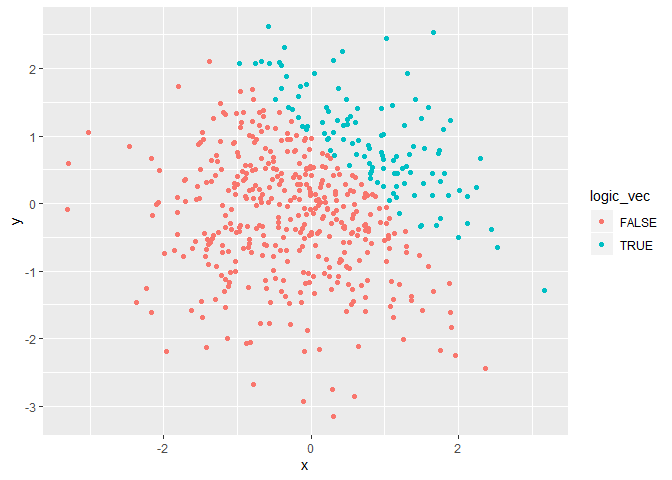
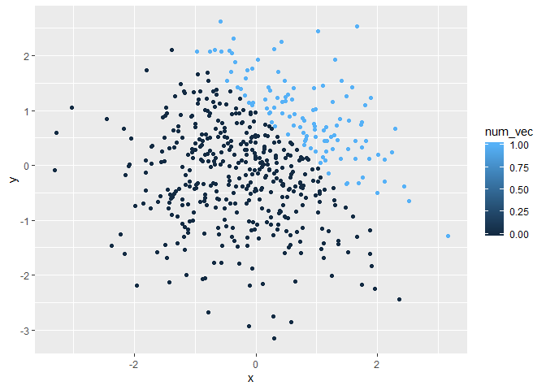

p8105\_hw1\_cs3779
================
CJ Snyder
9/19/2019

# Problem 1

## Creating Dataframe *hw\_df*

``` r
hw_df = tibble(
  rand_var = rnorm(8),
  logic_vec = rand_var > 0,
  char_vec = as.character(logic_vec,8),
  fact_vec = factor(char_vec, 3)
  )

mean(pull(hw_df, rand_var))
```

    ## [1] -0.2486404

``` r
mean(pull(hw_df, logic_vec))
```

    ## [1] 0.5

``` r
mean(pull(hw_df, char_vec))
```

    ## Warning in mean.default(pull(hw_df, char_vec)): argument is not numeric or
    ## logical: returning NA

    ## [1] NA

``` r
mean(pull(hw_df, fact_vec))
```

    ## Warning in mean.default(pull(hw_df, fact_vec)): argument is not numeric or
    ## logical: returning NA

    ## [1] NA

Trying to take the mean for *rand\_var* (numeric) and *logic\_vec*
(logical) were both successful. The mean of *logic\_vec* might be the
mean of the variables that came back **TRUE** if its value are greater
than 0. Meanwhile, it was not possible to take the mean (i.e. came back
as ‘**N/A**’) for *char\_vec* or *fact\_vec* as they are both neither
numeric nor logical. The only two types of variable that the mean
function works on are numeric or logical.

### Dataframe *hw\_df* Variable Conversion

``` r
# Converting logical vector to numeric
logic_to_numeric = as.numeric(hw_df$logic_vec)
prod_log_num = logic_to_numeric * (hw_df$rand_var)
mean(prod_log_num)

# Converting logical vector to factor
logic_to_factor = as.factor(hw_df$logic_vec)
prod_log_fact = logic_to_factor * (hw_df$rand_var)
mean(prod_log_fact)

#Converting logical vector to factor then numeric
logic_factor_numeric = as.numeric(logic_to_factor)
prod_log_fact_num = logic_factor_numeric * (hw_df$rand_var)
mean(prod_log_fact_num)
```

Trying to take the means of the converted variables indicates that you
can only take the mean of a numeric variable since the output for the
mean of the *prod\_log\_fact* variable was ‘**N/A**’ due to
*logic\_to\_factor* is a *factor* variable - similar to the first part
of Problem 1.

# Problem 2

## Creating Dataframe *hwplot\_df* for Plotting

``` r
hwplot_df = tibble(
  x = rnorm(500),
  y = rnorm(500),
  logic_vec = x + y > 1,
  num_vec = as.numeric(logic_vec),
  fact_vec = as.factor(logic_vec)
)
```

### Dataframe *hwplot\_df* Description

The dataframe *hwplot\_df* includes 500 observations and 5 variables,
including: *x*, *y*, *logic\_vec*, *num\_vec*, & *fact\_vec*. The number
of observations where the sum of *x+y=1* is 112. Additionally, the mean
of *x* is -0.060637, the median is -0.0669142, and the standard
deviation is
1.0102385.

## Scatterplot of Dataframe *hwplot\_df*

``` r
hw_plot_logic = ggplot(hwplot_df, aes(x=x,y=y,color=logic_vec)) + geom_point()
hw_plot_logic
```

<!-- -->

``` r
ggsave(hw_plot_logic, file = "hw_plot_logic.pdf")
```

    ## Saving 7 x 5 in image

``` r
#The color scale provides a gradient of color for shading the plot points. However, since this numeric variable is transforming a logical variable, the only two possible values are 0 or 1. This causes the points to be colored in a similar fashion as the logical plot - two distinct groupings of points (those whos sums are <1 and those whos sums are >1).
hw_plot_numeric = ggplot(hwplot_df, aes(x=x,y=y,color=num_vec)) + geom_point()
hw_plot_numeric
```

<!-- -->

``` r
#The color scale mimics exactly that of the logic_vec plot, where there are two distinct groupings of points (those whos sums are <1 and those whos sums are >1).
hw_plot_logic_factor = ggplot(hwplot_df, aes(x=x,y=y,color=fact_vec)) + geom_point()
hw_plot_logic_factor
```

<!-- -->
